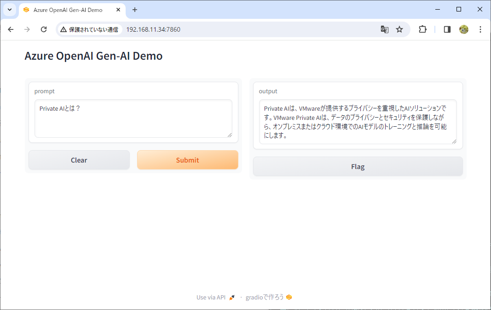

# Gradio OpenAI Service デモ

Gradioで、簡易的なAzure OpenAI Service の Web UIを作成する。

## 前提環境

```
# cat /etc/redhat-release
Red Hat Enterprise Linux release 8.9 (Ootpa)
# python -V
Python 3.11.5
```

## 前提パッケージのインストール
RPMのインストール
```
dnf install -y git python3.11 python3.11-pip
```

OSのファイアウォールは停止してある。
```
systemctl stop firewalld
systemctl disable firewalld
```

## Python環境の準備

venvの作成
```
python3 -m venv gradio
```

venvへの切り替え
```
source gradio/bin/activate
```

Pythonモジュールのインストール
```
pip3.11 install gradio
pip3.11 install openai==0.28
```

## スクリプトの編集

app.pyファイルの、Azure OpenAI インスタンスの関連パラメータを編集する。

example:

* aoai_instance = "demo-aoia-01"
* deployment_id = "gpt35-tarbo-01"

```
vi app.py
```

環境変数として、OPENAI_API_KEYを設定する。

```
export OPENAI_API_KEY=xxxxxxxxxxxxxxxxxxxxx
```

app.pyを実行する。
```
python3.11 ./app.py
```

ブラウザから、実行中のマシンの7860ポートにアクセスする。
* このアプリでは、1ショットでの回答のみ対応。チャット履歴は持たない。
* Flag ボタンをクリックすると、Linuxマシン側のflagged/log.csvファイルに生成内容が保存される。




## おまけ

同様の生成処理を、gen-text.pyでも実行できる。
* ただし、プロンプトはスクリプト内に直接記述してある。

```
python3.11 ./gen-text.py
```